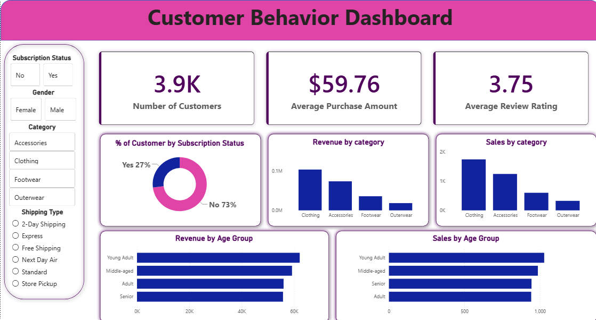

# Customer Behavior Analytics Pipeline



## 📌 Project Overview

This project is an **end-to-end customer shopping behavior analytics pipeline** built using **Python, PostgreSQL, SQL, and Power BI**.  
The goal of the project is to transform raw customer transaction data into a clean analytical dataset, store it inside a PostgreSQL database, perform SQL-based business analysis, and build an interactive Power BI dashboard for decision-making.

The project demonstrates a complete real-world analytics workflow:

```text
Raw CSV Dataset → Python + Pandas → PostgreSQL → DBeaver SQL Analysis → Power BI Dashboard → Business Insights
```

---

## 🎯 Business Objective

The business objective was to analyze customer shopping behavior and answer key business questions such as:

- Which product categories generate the highest revenue?
- Which customer age groups contribute the most sales?
- How do subscribers and non-subscribers behave differently?
- Which products are the strongest revenue contributors?
- What is the average customer purchase value?
- How can the business use customer segmentation to improve marketing and inventory planning?

---

## 🧱 Solution Architecture


The pipeline follows a structured analytics engineering approach:

1. **Raw CSV Dataset**  
   Customer shopping behavior data was used as the source file.

2. **Python + Pandas Data Preparation**  
   Data was loaded, cleaned, transformed, and feature-engineered using Pandas.

3. **PostgreSQL Database Layer**  
   The cleaned DataFrame was pushed into PostgreSQL using SQLAlchemy.

4. **DBeaver SQL Analysis**  
   SQL queries were written for revenue analysis, product analysis, subscription analysis, and customer segmentation.

5. **Power BI Dashboard**  
   Power BI was connected to PostgreSQL to create an interactive dashboard with KPI cards, charts, and slicers.

---

## 🛠️ Tech Stack

| Layer | Technology | Purpose |
|---|---|---|
| Data Source | CSV | Raw customer shopping data |
| Data Processing | Python, Pandas | Data cleaning and feature engineering |
| Database Connectivity | SQLAlchemy, psycopg2 | Python-to-PostgreSQL connection |
| Database | PostgreSQL | Structured analytics storage |
| SQL IDE | DBeaver | SQL exploration and analysis |
| Visualization | Power BI Desktop | Interactive dashboard and reporting |
| Documentation | PDF, PPT | Portfolio presentation and technical report |

---

## 📂 Repository Structure

```text
customer-behavior-analytics-pipeline/
│
├── data/
│   └── customer_shopping_behavior.csv
│
├── notebooks/
│   └── data_cleaning_pipeline.ipynb
│
├── sql/
│   └── analysis_queries.sql
│
├── assets/
│   ├── dashboard_preview.png
│   ├── pipeline_architecture.png
│   └── sql_analysis_preview.png
│
├── reports/
│   └── Customer_Shopping_Behavior_Portfolio_Report_Final.pdf
│
├── presentation/
│   └── Customer-Shopping-Behavior-Analytics-Pipeline.pptx
│
├── requirements.txt
├── .gitignore
└── README.md
```

---

## 🧹 Data Cleaning & Feature Engineering

The raw dataset was cleaned and transformed using Python and Pandas.

### Key Data Preparation Steps

- Loaded raw CSV into a Pandas DataFrame.
- Standardized column names into lowercase `snake_case` format.
- Filled missing `review_rating` values using **category-wise median imputation**.
- Created an `age_group` column for demographic segmentation.
- Converted text-based purchase frequency values into numeric day values.
- Removed redundant columns after validation.

### Example Column Standardization

| Original Column | Cleaned Column |
|---|---|
| Customer ID | customer_id |
| Purchase Amount (USD) | purchase_amount_usd |
| Review Rating | review_rating |
| Subscription Status | subscription_status |
| Frequency of Purchases | frequency_of_purchases |

### Feature Engineering Examples

| New Feature | Description |
|---|---|
| `age_group` | Groups customers into Young Adult, Adult, Middle-aged, and Senior segments |
| `purchase_frequency_days` | Converts Weekly, Monthly, Quarterly, etc. into numeric day values |
| `review_rating` | Missing ratings filled using category-wise median values |

---

## 🗄️ PostgreSQL Database Layer

After cleaning the data, the transformed Pandas DataFrame was loaded into a local PostgreSQL database using SQLAlchemy.

The database layer helped convert a flat CSV file into a structured analytics table that could be used by both SQL tools and Power BI.

### Database Workflow

```text
Cleaned Pandas DataFrame → SQLAlchemy Engine → PostgreSQL Table → SQL + Power BI
```

### Why PostgreSQL?

- Stores cleaned data in a structured format.
- Supports advanced SQL analysis.
- Integrates with Power BI.
- Makes the project closer to a real production analytics workflow.

---

## 🔍 SQL Analysis

SQL analysis was performed in DBeaver on top of the PostgreSQL database.


### SQL Techniques Used

- Aggregations
- `GROUP BY` analysis
- Common Table Expressions
- Window functions
- Ranking queries
- Subscriber vs non-subscriber analysis
- Product and category performance analysis

### Example Business Questions Answered

- Total revenue by gender
- Customers using discounts who spent more than average
- Top 5 products by average review rating
- Standard vs Express shipping purchase comparison
- Subscriber vs non-subscriber revenue comparison
- Top products by discount usage

---

## 📊 Power BI Dashboard

The final dashboard was created in Power BI Desktop by connecting directly to the PostgreSQL database.


### Dashboard Components

- KPI Cards
  - Total Customers
  - Average Purchase Amount
  - Average Review Rating
- Donut Chart
  - Subscription Status split
- Bar and Column Charts
  - Revenue by Category
  - Sales by Category
  - Revenue by Age Group
  - Sales by Age Group
- Interactive Slicers
  - Subscription Status
  - Gender
  - Category
  - Shipping Type

---

## 📈 Key Business Insights

### Executive KPIs

| Metric | Value |
|---|---:|
| Total Customers | 3.9K |
| Average Purchase Amount | $59.76 |
| Average Review Rating | 3.75 |

### Subscription Status

| Subscription Status | Share |
|---|---:|
| Non-Subscribers | 73% |
| Subscribers | 27% |

**Insight:** Non-subscribers represent the majority of the customer base, showing a clear opportunity for subscription conversion campaigns.

### Revenue by Category

| Category | Revenue | Sales Volume |
|---|---:|---:|
| Clothing | $104,264 | 1,737 |
| Accessories | $74,200 | 1,240 |
| Footwear | $36,093 | 599 |
| Outerwear | $18,524 | 324 |

**Insight:** Clothing is the strongest category by both revenue and sales volume, making it a priority segment for marketing, inventory planning, and campaign targeting.

### Age Group Revenue

| Age Group | Revenue |
|---|---:|
| Young Adult | $62,143 |
| Middle-aged | $59,197 |
| Adult | $55,978 |
| Senior | $55,763 |

**Insight:** Young Adults generated the highest revenue and can be treated as a high-value customer segment.

### Seasonal Revenue

| Season | Revenue |
|---|---:|
| Fall | $60,018 |
| Spring | $58,679 |
| Winter | $58,607 |
| Summer | $55,777 |

**Insight:** Fall generated the highest seasonal revenue, making it an important period for campaign planning.

### Top Product Revenue

| Product | Revenue |
|---|---:|
| Blouse | $10,410 |
| Shirt | $10,332 |
| Dress | $10,320 |
| Pants | $10,090 |
| Jewelry | $10,010 |

**Insight:** These products can be treated as hero products for promotions and inventory prioritization.

---

## 🚀 How to Run This Project Locally

### 1. Clone the Repository

```bash
git clone https://github.com/bansalsamarth1/customer-behavior-analytics-pipeline.git
cd customer-behavior-analytics-pipeline
```

### 2. Create a Virtual Environment

```bash
python -m venv .venv
```

Activate it:

```bash
# Windows
.venv\Scripts\activate

# macOS/Linux
source .venv/bin/activate
```

### 3. Install Dependencies

```bash
pip install -r requirements.txt
```

### 4. Set Up PostgreSQL

Create a local PostgreSQL database, for example:

```text
customer_behavior_db
```

Update your connection details in the notebook or use environment variables for better security.

### 5. Run the Notebook

Open and run:

```text
notebooks/data_cleaning_pipeline.ipynb
```

This will:

- Load the CSV file
- Clean and transform the data
- Create engineered columns
- Push the cleaned DataFrame into PostgreSQL

### 6. Run SQL Analysis

Open the SQL file in DBeaver:

```text
sql/analysis_queries.sql
```

Run the queries against the PostgreSQL table.

### 7. Open Power BI Dashboard

Connect Power BI Desktop to the PostgreSQL database and import the cleaned table.

---

## 📦 Deliverables

| Deliverable | Description |
|---|---|
| Python Notebook | Data cleaning and PostgreSQL loading pipeline |
| SQL File | Business analysis queries |
| CSV Dataset | Raw customer shopping behavior data |
| Power BI Dashboard Screenshot | Final visual dashboard preview |
| PDF Report | Technical and business project report |
| PowerPoint Presentation | Portfolio-ready project presentation |

---

## 💼 Skills Demonstrated

### Data Engineering

- CSV ingestion
- Data cleaning pipeline
- Feature engineering
- PostgreSQL data loading
- Database-backed analytics workflow

### Python & Pandas

- DataFrame manipulation
- Missing value handling
- Group-based transformations
- Column normalization
- Categorical mapping

### SQL

- Aggregations
- CTEs
- Window functions
- Ranking
- Business analysis queries

### Business Intelligence

- Power BI dashboard design
- KPI creation
- Slicer-based interactivity
- Executive-level data storytelling
- Revenue and customer segmentation analysis

---

## 🧠 Project Learning Outcome

This project demonstrates the ability to build a full analytics workflow from raw data to business-ready insights.

It reflects practical skills required for roles such as:

- Data Analyst
- Business Intelligence Analyst
- Data Engineer
- Analytics Engineer
- SQL Developer
- Power BI Developer

---

## 👤 Author

**Samarth Bansal**  
GitHub: [bansalsamarth1](https://github.com/bansalsamarth1)

---

## ⭐ Final Note

This project is designed as a portfolio case study to show practical capability in data cleaning, database design, SQL analysis, and dashboard storytelling.

```text
Raw Data → Clean Data → Database → SQL Insights → BI Dashboard → Business Decisions
```
